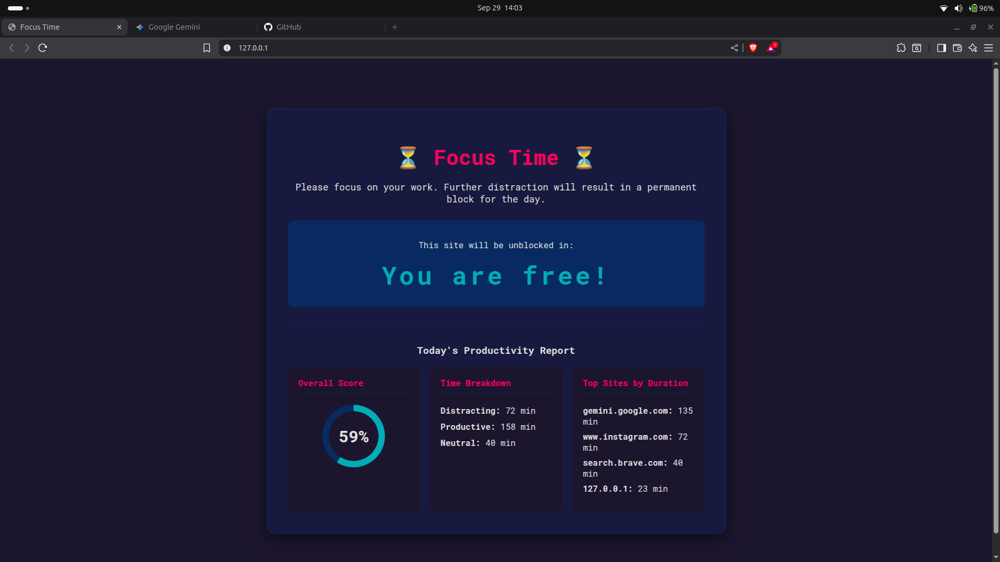

# FocusGuard: The LLM-Powered Productivity Guardian 🛡️🧠

FocusGuard is a smart, automated website blocker for Ubuntu that helps you stay on track. It intelligently analyzes your daily Brave browser activity using an LLM, identifies distracting patterns, and enforces focus blocks by serving a dynamic, personalized dashboard right on your local machine.

---

**Screenshot:**


---

## ✨ Core Features

* **Intelligent Analysis**: Leverages Google's Gemini LLM to analyze browser history and understand productivity vs. distraction.
* **Dynamic Blocking**: Automatically blocks distracting sites using the system's `hosts` file when distraction limits are exceeded.
* **Custom Block Page**: Serves a local HTTP page when a site is blocked.
* **Productivity Dashboard**: The block page displays a real-time countdown timer and a detailed dashboard of your daily productivity stats.
* **Stateful Memory**: Remembers your activity throughout the day to make increasingly informed blocking decisions.
* **Automated & Persistent**: Runs as a background service and starts automatically when you log in.

---

## ⚙️ How It Works

FocusGuard is composed of several scripts that work together as a complete system:

1.  **History & Analysis**: A script runs periodically to fetch recent Brave browser history. This data, along with the previous analysis state, is sent to the Gemini LLM.
2.  **Decision Making**: The LLM analyzes the cumulative data and returns a JSON object with updated productivity stats and a blocking decision (`none`, `temporary`, or `permanent`).
3.  **Enforcement (`blocker.py`)**: A background service constantly monitors the decision file. When a block is triggered, it:
    * Modifies the `/etc/hosts` file to redirect distracting domains to `127.0.0.1`.
    * Terminates the Brave browser to apply the changes immediately.
4.  **Feedback (`web_server.py`)**: A lightweight Flask server runs locally on port 80 (HTTP), serving the custom block page and dashboard to any redirected traffic.
5.  **Automation (`start_focusguard.sh`)**: A startup script manages all background services, ensuring the system is always running when you're logged in.

---

## 🚀 Installation & Setup

Follow these steps carefully to get FocusGuard running on your Ubuntu system.

### Prerequisites

* Ubuntu 20.04 or later.
* Brave Browser.
* Python 3.8+ and Pip.
* A Google AI (Gemini) API Key from [Google AI Studio](https://aistudio.google.com/app/apikey).
* `openssl` command-line tool (usually pre-installed).

### Step-by-Step Guide

1.  **Clone the Repository**
    ```bash
    git clone [https://github.com/manish9250/FocusGuard.git](https://github.com/manish9250/FocusGuard.git)
    cd FocusGuard
    ```

2.  **Set Up Virtual Environment**
    ```bash
    python3 -m venv venv
    source venv/bin/activate
    ```

3.  **Install Dependencies**
    Create a `requirements.txt` file with the following content:
    ```
    google-generativeai
    pandas
    Flask
    ```
    Then, run the installation command:
    ```bash
    pip install -r requirements.txt
    ```

4.  **Create `.env` File for API Key (Security)**
    Create a file named `.env` and add your secret key. **This file will be ignored by Git and will not be uploaded.**
    ```
    GOOGLE_API_KEY="YOUR_API_KEY_HERE"
    ```


5.  **Configure `sudoers` for Password-less Startup**
    This is a critical step to allow the startup script to run with the necessary permissions.
    * Run `sudo visudo`. This is the only safe way to edit this file.
    * Scroll to the very bottom and add the following line. **Replace `your_username` with your actual username.**

    ```
    your_username ALL=(ALL) NOPASSWD: /home/your_username/path/to/FocusGuard/start_focusguard.sh
    ```
    * Save and exit by pressing `Ctrl+X`, then `Y`, then `Enter`.

6.  **Configure the Startup Script**
    * Open the `start_focusguard.sh` file.
    * Edit the `PROJECT_DIR` variable to match the **full, absolute path** to your `FocusGuard` directory.

---

## 💻 Usage

### Manual Start/Stop
* **To start** the services (blocker and web server):
    ```bash
    sudo ./start_focusguard.sh
    ```

### Run on Startup (Recommended)
1.  Make sure you have completed all setup steps above.
2.  Search for and open **"Startup Applications"** on your Ubuntu desktop.
3.  Click **Add**.
4.  Fill in the fields:
    * **Name**: `FocusGuard Service`
    * **Command**: `sudo /home/your_username/path/to/FocusGuard/start_focusguard.sh`
    * **Comment**: `Starts the AI-powered website blocker.`
5.  Click **Add**. The service will now start automatically every time you log in.

---

## ⚠️ Troubleshooting

* **HTTPS Security Warning**: When redirected to a blocked site, your browser will show a security warning ("Your connection is not private"). This is expected because we are using a self-signed certificate. You must click **"Advanced"** and **"Proceed to... (unsafe)"** to view the dashboard.
* **Logs**: If something isn't working, check the log files generated in the project directory (`focusguard.log`, `blocker.log`, `webserver.log`). They contain valuable debugging information.

---

## 📄 License

This project is licensed under the MIT License. See the `LICENSE` file for details.